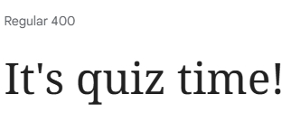
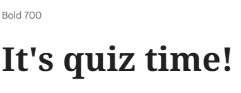
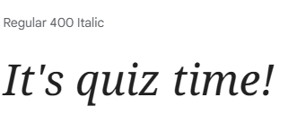
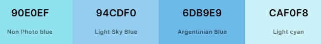

# It's Quiz Time!
On the website presented, you can play a short Quiz against the clock and reach the top of the leaderboard! You get asked 10 questions in a maximum of 100 seconds. The more you answer correctly in as little time as possible, the higher your score!

## User Story
### First Time Visitor
- As a new visitor to the page, I directly want to understand the structure
- I want to be able to start a game quickly and easily
- I want to learn something new and test my knowledge
- I want to have fun from the first minute on!

### Regular Visitor
- I want to top the high score
- I want to send in questions of my own
- I want to have different questions than the last time

## Features
The website will feature an easy-to-understand quiz which you can start to play directly! Interesting questions on many different topics get asked randomly and a score for each round gets calculated.

### Technology used
- For the general structure of the page, [HTML](https://www.w3schools.com/html/) was used
- For styling purposes, [CSS](https://www.w3schools.com/html/html_css.asp) was used
    - [Flexbox](https://www.w3schools.com/css/css3_flexbox.asp) was used to make elements responsive
    - [Media queries](https://www.w3schools.com/css/css3_mediaqueries.asp) were used to change the dynamic of the content for smaller screens
    - [Grid](https://www.w3schools.com/css/css_grid.asp) was used to create the answer section of the game
- To add interactivity and dynamic behavior [Javascript](https://www.w3schools.com/js/) was used
- For the creation of the wireframes and the workflow, [Balsamiq](https://balsamiq.com/) was used
- For writing and editing the code [Gitpod](https://www.gitpod.io/) was used
- To host the code and the website [Github](https://github.com/) was used
- For the version control of the website [Git](https://git-scm.com/) was used

## Design
### Wireframes
The following wireframes were drawn for the project:
- Wireframe for [index.html](documentation/index.webp)
- Wireframe for [game.html](documentation/game.webp)

### Font
The font used throughout the website is "Noto Serif", which is implemented through Google Fonts.  
Since it is important for the quiz that all questions and answers can be read and understood quickly, the clean and readable design of "Noto Serif" is a great advantage. Through the balanced proportions and consistent spacing, everything looks visually very pleasing.

### Colors
For the coloring of the website, a mixture of blue and light cyan colors was used. Through the harmonious and subtle feeling they create, a peaceful atmosphere to concentrate in is created. At the same time, the colors deliver a certain contrast without being overpowering.

## Bugs
### Unsolved Bugs
No unsolved Bugs are left.

### Solved Bugs
While developing the game, the following bugs were found and corrected:
- The quiz UI encountered a layout issue when displaying lengthy questions or answers. Text content overflowed its designated containers, making it unreadable on some screens.
To address this, the container elements responsible for holding questions and answers were modified. Their height property was adjusted from a fixed value to min-height. This allows the containers to dynamically expand vertically to accommodate overflowing content, ensuring readability even on smaller devices with limited screen width (constrained by a fixed max-width property, if applicable).

- When starting the game, answering the first question didn't update the quiz. The player could click answers infinitely without progressing to the next question. This also prevented the checkAnswer function from working properly.
To solve the problem, I moved the event listener for answer clicks and the logic for checking answers and updating the score outside of the startGame function. This ensures the listener and logic are active throughout the game. Additionally, the startGame function now receives the questionsAsked and score variables from the event listener logic, allowing the game to update after each answer and track the score.

- The final score wasn't displaying correctly on the end screen. The endQuiz function received an undefined value for the score.
Whilst checking the code, the issue could be tracked down to the calculateScore function. Here were two problems found. The variable score wasn't declared with let and the return statement for score was missing.
After correcting this two errors the score gets calculated correctly and shows on the endscreen.

## Credits
### Tools
The following tools and websites were used in the creation of this website:
- [Google Fonts](https://fonts.google.com/) to find and implement the font
- [Balsamiq](https://balsamiq.com/) for creation of the Wireframes
- [freeconvert.com](https://www.freeconvert.com/de/webp-converter) to convert images to webp-format
- [Dopelycolors](https://colors.dopely.top/) to find a color palette

### Content
The questions and answers are taken from the ["LiveReacting Blog"](https://blog.livereacting.com/100-fun-general-knowledge-quiz-questions-2024/).

### Logic
To build the Fisher-Yates sorting algorithm that randomizes the array the following content was very helpful:
- [w3schools about the Fisher-Yates Method](https://www.w3schools.com/js/tryit.asp?filename=tryjs_array_sort_random2)
- [A concise video of "Bro Code" about the Fisher-Yates-Shuffle](https://www.youtube.com/watch?v=FGAUekwri1Q)

To build the eventListeners for the project, it was really helpful to look up again how it was done in the [Love Maths Walkthrough project](https://github.com/Code-Institute-Solutions/love-maths-2.0-sourcecode).

For realizing a timeout function I used this article from [freecodecamp](https://www.freecodecamp.org/news/javascript-settimeout-how-to-set-a-timer-in-javascript-or-sleep-for-n-seconds/).

For implementing a countdown the following article from [w3schools about the setInterval()](https://www.w3schools.com/jsref/met_win_setinterval.asp) helped a lot.