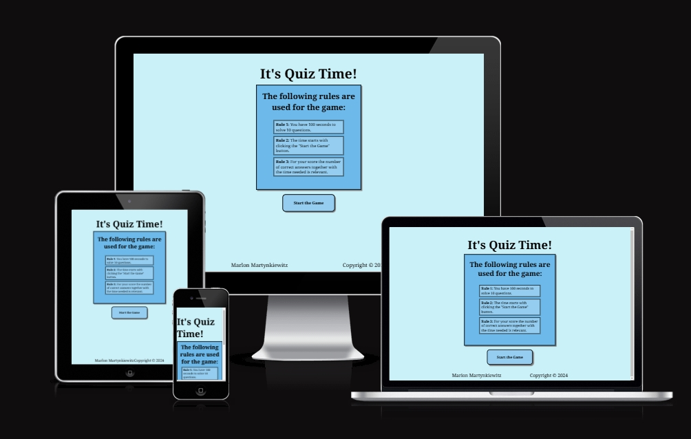
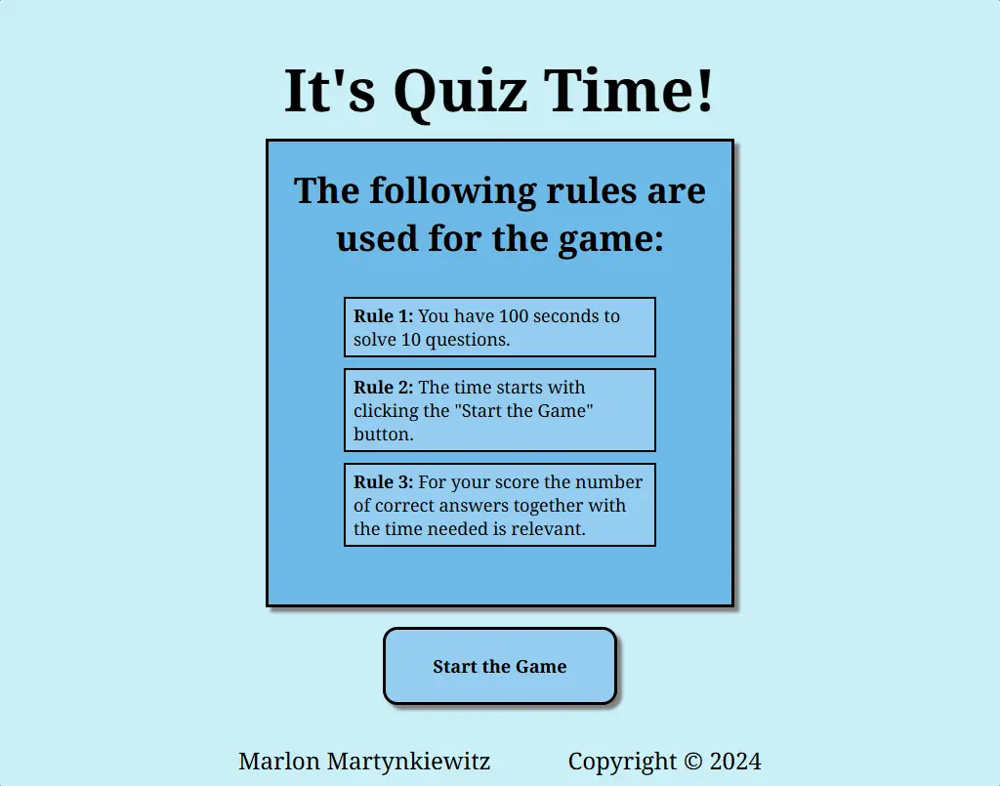
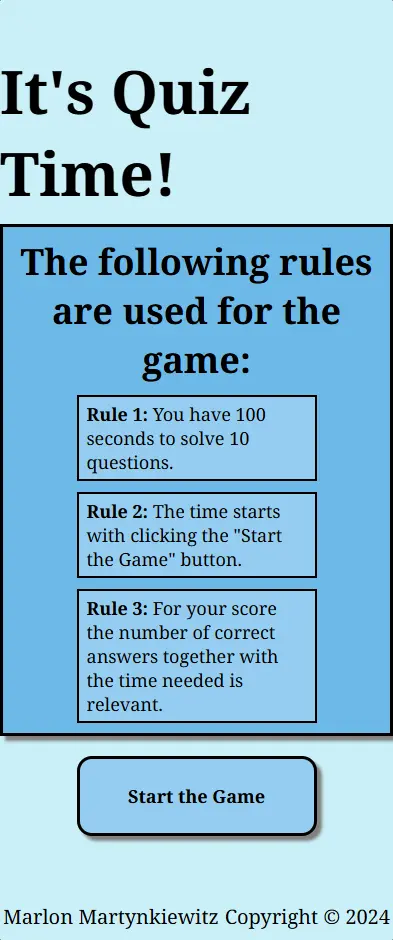
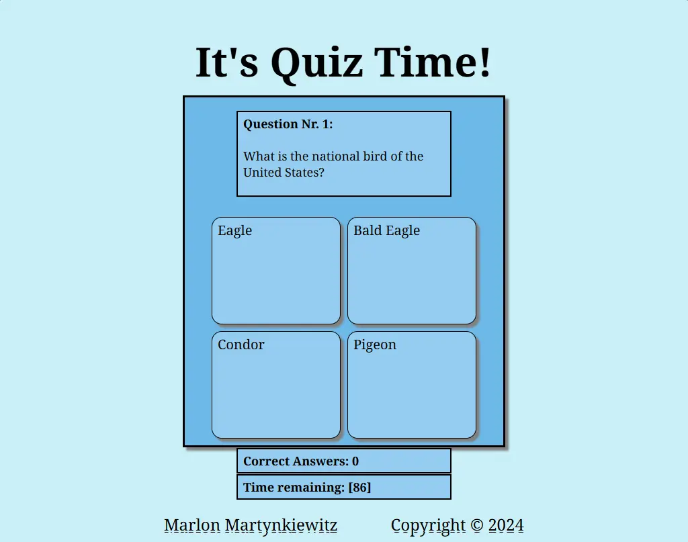
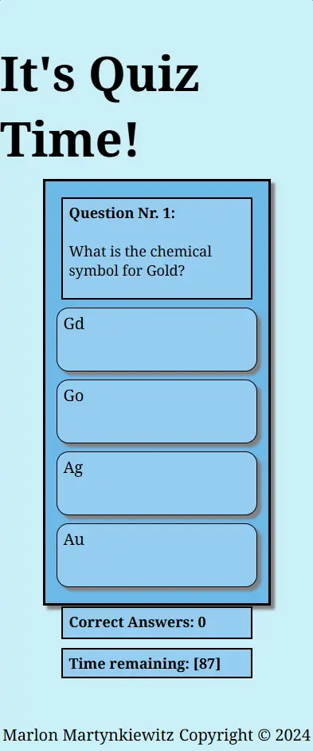
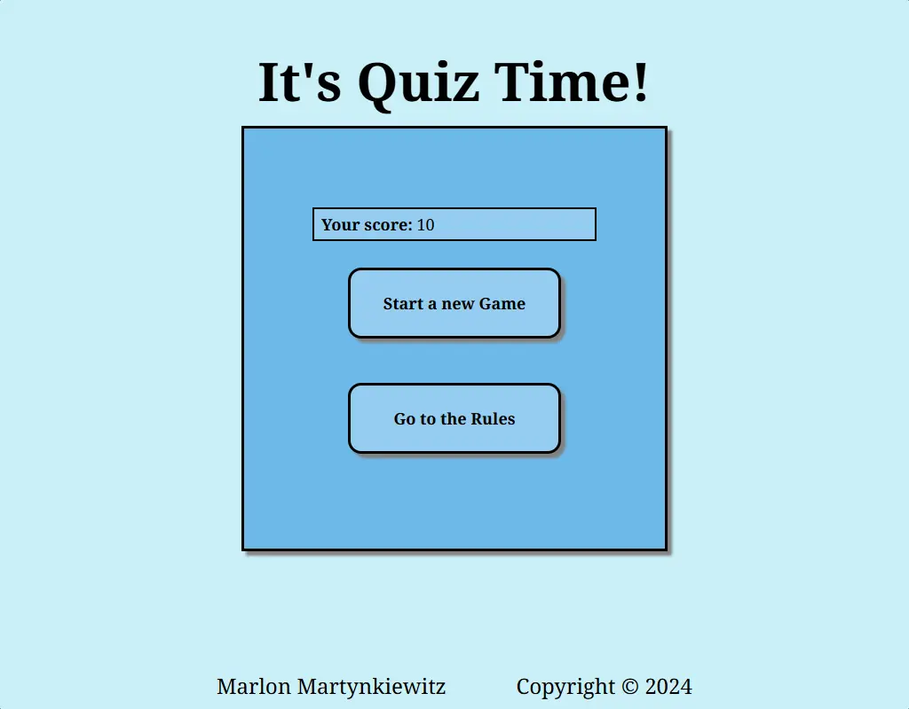
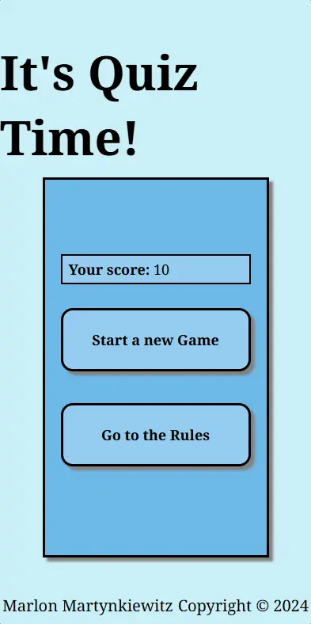

# It's Quiz Time!
On the website presented, you can play a short Quiz against the clock and reach the top of the leaderboard! You get asked 10 questions in a maximum of 100 seconds. The more you answer correctly in as little time as possible, the higher your score!

Click [here](https://mrmarlonm.github.io/quiz-game/index.html) for the deployed version of the game.

## User Story
### First Time Visitor
- As a new visitor to the page, I directly want to understand the structure
- I want to be able to start a game quickly and easily
- I want to learn something new and test my knowledge
- I want to have fun from the first minute on!

### Regular Visitor
- I want to top the high score
- I want to send in questions of my own
- I want to have different questions than the last time

### Outlook
In the future, the page could be updated to contain a global leaderboard and allow players the opportunity to send in questions of their own. For now, only the needs of the first-time visitors will be fulfilled and the calculated high score will only be shown on the end screen.

## Features
The website will feature an easy-to-understand quiz which you can start to play directly! Interesting questions on many different topics get asked randomly and a score for each round gets calculated.

### Technology used
- For the general structure of the page, [HTML](https://www.w3schools.com/html/) was used
- For styling purposes, [CSS](https://www.w3schools.com/html/html_css.asp) was used
    - [Flexbox](https://www.w3schools.com/css/css3_flexbox.asp) was used to make elements responsive
    - [Media queries](https://www.w3schools.com/css/css3_mediaqueries.asp) were used to change the dynamic of the content for smaller screens
    - [Grid](https://www.w3schools.com/css/css_grid.asp) was used to create the answer section of the game
- To add interactivity and dynamic behavior [Javascript](https://www.w3schools.com/js/) was used
- For the creation of the wireframes and the workflow, [Balsamiq](https://balsamiq.com/) was used
- For writing and editing the code [Gitpod](https://www.gitpod.io/) was used
- To host the code and the website [Github](https://github.com/) was used
- For the version control of the website [Git](https://git-scm.com/) was used

### Navigation
The navigation on the website will happen through buttons. Since there is no specific navigation section, it will be explained further down, together with the specific pages.

### Start Screen with Rules
The landing page contains the heading in big bold letters saying "It's Quiz Time!". Following is a short explanation of the rules and a button that lets the user start the game.
In the footer is the name of the author which is at the same time a clickable link that opens the github page of the author in a new tab. Also, the copyright is found in it.

Here is an image of the landing page on big screens:

For mobile screens, the content stays essentially the same, but the text field takes up 100% of the width.
Here is an image showing the landing page on a mobile device:

### Game page with the quiz
On the game.html page, the actual quiz is happening.  
At the top sits the title, followed by the question together with a counter on what question out of ten the player is at the moment.  
After that, the answer fields are presented. They have a box-shadow to put them in the front and show the user that they are clickable.  
Under the container holding the question and the answer options are a counter for the correct answers and a countdown for the time.  
At the bottom is once again the footer.

Here is an image of the game on a large screen:

On a small screen, everything gets thinned out and the answer options are presented under each other to maintain good readability.  
Here is an image of the game on a small screen:

### End screen
After finishing the game, the end screen will be presented.  
On it, the calculated score for the round will be shown together with two buttons. One button to start a new game brings the user back to the game page and the other button brings the user back to the rules and therefore links to the landing page.

Here is an image of the end screen on a large screen:

Here is an image of the end screen on a small device:

## Design
### Wireframes
The following wireframes were drawn for the project:
- Wireframe for [index.html](documentation/index.webp)
- Wireframe for [game.html](documentation/game.webp)

### Font
The font used throughout the website is "Noto Serif", which is implemented through Google Fonts.  
Since it is important for the quiz that all questions and answers can be read and understood quickly, the clean and readable design of "Noto Serif" is a great advantage. Through the balanced proportions and consistent spacing, everything looks visually very pleasing.

### Colors
For the coloring of the website, a mixture of blue and light cyan colors was used. Through the harmonious and subtle feeling they create, a peaceful atmosphere to concentrate in is created. At the same time, the colors deliver a certain contrast without being overpowering.

## Testing
### Manual Testing
to ensure that everything works on a wide variety of devices the game was tested in Chrome, Firefox, Opera and on a Google Pixel Phone. Whilst testing the page and all its functions manually, no problems were found and everything works as intended.  
Further down the table containing the testing data is provided.

| Browser | Page | Action | Expected Result | Did it work? | Notes |
| --- | --- | --- | --- | --- | --- |
| Chrome | index.html (rules) | Button "Start the Game" | Load page game.html | Yes | - |
| Chrome | index.html (rules) | Footer link author | Open Github page | Yes | Opens in new tab |
| Chrome | game.html | Question Nr. | After loading the next question one gets added | Yes | - |
| Chrome | game.html | Click answer 1 | Answer gets selected, new question loads | Yes | - |
| Chrome | game.html | Click answer 2 | Answer gets selected, new question loads | Yes | - |
| Chrome | game.html | Click answer 3 | Answer gets selected, new question loads | Yes | - |
| Chrome | game.html | Click answer 4 | Answer gets selected, new question loads | Yes | - |
| Chrome | game.html | Corrects answers counter | With each correct answer one gets added | Yes | Only correct answers are counted |
| Chrome | game.html | time remaining countdown | Each second one gets subtracted, when reaching zero the game ends | Yes | - |
| Chrome | game.html | Footer link author | Open Github page | Yes | Opens in new tab |
| Chrome | end screen | Button "Start new Game" | Loads a new game | Yes | - |
| Chrome | end screen | Button "Go to Rules" | Loads index.html | Yes | - |
| Chrome | end screen | Footer link author | Open Github page | Yes | Opens in new tab | 
| Chrome | index.html (rules) | Button "Start the Game" | Load page game.html | Yes | - |
| Chrome | index.html (rules) | Footer link author | Open Github page | Yes | Opens in new tab |
| Firefox | game.html | Question Nr. | After loading the next question one gets added | Yes | - |
| Firefox | game.html | Click answer 1 | Answer gets selected, new question loads | Yes | - |
| Firefox | game.html | Click answer 2 | Answer gets selected, new question loads | Yes | - |
| Firefox | game.html | Click answer 3 | Answer gets selected, new question loads | Yes | - |
| Firefox | game.html | Click answer 4 | Answer gets selected, new question loads | Yes | - |
| Firefox | game.html | Corrects answers counter | With each correct answer one gets added | Yes | Only correct answers are counted |
| Firefox | game.html | time remaining countdown | Each second one gets subtracted, when reaching zero the game ends | Yes | - |
| Firefox | game.html | Footer link author | Open Github page | Yes | Opens in new tab |
| Firefox | end screen | Button "Start new Game" | Loads a new game | Yes | - |
| Firefox | end screen | Button "Go to Rules" | Loads index.html | Yes | - |
| Firefox | end screen | Footer link author | Open Github page | Yes | Opens in new tab | 
| Opera | index.html (rules) | Button "Start the Game" | Load page game.html | Yes | - |
| Opera | index.html (rules) | Footer link author | Open Github page | Yes | Opens in new tab |
| Opera | game.html | Question Nr. | After loading the next question one gets added | Yes | - |
| Opera | game.html | Click answer 1 | Answer gets selected, new question loads | Yes | - |
| Opera | game.html | Click answer 2 | Answer gets selected, new question loads | Yes | - |
| Opera | game.html | Click answer 3 | Answer gets selected, new question loads | Yes | - |
| Opera | game.html | Click answer 4 | Answer gets selected, new question loads | Yes | - |
| Opera | game.html | Corrects answers counter | With each correct answer one gets added | Yes | Only correct answers are counted |
| Opera | game.html | time remaining countdown | Each second one gets subtracted, when reaching zero the game ends | Yes | - |
| Opera | game.html | Footer link author | Open Github page | Yes | Opens in new tab |
| Opera | end screen | Button "Start new Game" | Loads a new game | Yes | - |
| Opera | end screen | Button "Go to Rules" | Loads index.html | Yes | - |
| Opera | end screen | Footer link author | Open Github page | Yes | Opens in new tab | 
| Phone | index.html (rules) | Button "Start the Game" | Load page game.html | Yes | - |
| Phone | index.html (rules) | Footer link author | Open Github page | Yes | Opens in new tab |
| Phone | game.html | Question Nr. | After loading the next question one gets added | Yes | - |
| Phone | game.html | Click answer 1 | Answer gets selected, new question loads | Yes | - |
| Phone | game.html | Click answer 2 | Answer gets selected, new question loads | Yes | - |
| Phone | game.html | Click answer 3 | Answer gets selected, new question loads | Yes | - |
| Phone | game.html | Click answer 4 | Answer gets selected, new question loads | Yes | - |
| Phone | game.html | Corrects answers counter | With each correct answer one gets added | Yes | Only correct answers are counted |
| Phone | game.html | time remaining countdown | Each second one gets subtracted, when reaching zero the game ends | Yes | - |
| Phone | game.html | Footer link author | Open Github page | Yes | Opens in new tab |
| Phone | end screen | Button "Start new Game" | Loads a new game | Yes | - |
| Phone | end screen | Button "Go to Rules" | Loads index.html | Yes | - |
| Phone | end screen | Footer link author | Open Github page | Yes | Opens in new tab | 

### Validator Testing
- HTML
    - When testing index.html, no errors were returned from the [official W3C validator](https://validator.w3.org/nu/?doc=https%3A%2F%2Fmrmarlonm.github.io%2Fquiz-game%2Findex.html)
    - When testing game.html, no errors were returned from the [official W3C validator](https://validator.w3.org/nu/?doc=https%3A%2F%2Fmrmarlonm.github.io%2Fquiz-game%2Fgame.html)
- CSS
    - No errors were returned when passing the [(jigsaw) validator](https://jigsaw.w3.org/css-validator/validator?uri=https%3A%2F%2Fmrmarlonm.github.io%2Fquiz-game%2Fassets%2Fcss%2Fstyle.css&profile=css3svg&usermedium=all&warning=1&vextwarning=&lang=en)
- Javascript
    - There were no problems found when passing the (jshint javascript validator)[https://jshint.com/]

## Bugs
### Unsolved Bugs
No unsolved Bugs are left.

### Solved Bugs
While developing the game, the following bugs were found and corrected:
- The quiz UI encountered a layout issue when displaying lengthy questions or answers. Text content overflowed its designated containers, making it unreadable on some screens.
To address this, the container elements responsible for holding questions and answers were modified. Their height property was adjusted from a fixed value to min-height. This allows the containers to dynamically expand vertically to accommodate overflowing content, ensuring readability even on smaller devices with limited screen width (constrained by a fixed max-width property, if applicable).

- When starting the game, answering the first question didn't update the quiz. The player could click answers infinitely without progressing to the next question. This also prevented the checkAnswer function from working properly.
To solve the problem, I moved the event listener for answer clicks and the logic for checking answers and updating the score outside of the startGame function. This ensures the listener and logic are active throughout the game. Additionally, the startGame function now receives the questionsAsked variable and score variables from the event listener logic, allowing the game to update after each answer and track the score.

- The final score wasn't displaying correctly on the end screen. The endQuiz function received an undefined value for the score.
Whilst checking the code, the issue could be tracked down to the calculateScore function. There were two problems found. The variable score wasn't declared with let and the return statement for the score was missing.
After correcting these two errors the score gets calculated correctly and shows on the endscreen.

- After running the endGame() function, the error "Uncaught TypeError: Cannot read properties of null (reading 'innerHTML')" appeared in the console. This error originated from the updateCorrectAnswers() and updateTime() functions attempting to access elements that no longer existed in the DOM. The error was also caused by the calculateScore() function for the same reason. The issue came up because the functions tried to access the span with the id "correct-answers" and the span with the id "time-remaining", but both spans got removed from the endGame() function. 
To resolve the issue an if statement was implemented in all three functions. The statement checks if the targeted elements still exist in the DOM and only executes the code when they do.

## Deployment
### Deployment to Github Pages
The website was deployed to GitHub pages ([here](https://mrmarlonm.github.io/quiz-game/index.html)). 

Here are the steps taken:
- In the GitHub repository navigate to Settings
- Under the point "Code and Automation" click on pages
- Find the drop-down menu for the source section and select the Main Branch
- Click on "Save"
- Now the page is deployed and after refreshing a link to the page will be provided

### Local Deployment
It is also possible to open a cloned version of the page, For that you need to type the following in your IDE Terminal:
- `git clone https://github.com/MrMarlonM/quiz-game.git`

## Credits
### Tools
The following tools and websites were used in the creation of this website:
- [Google Fonts](https://fonts.google.com/) to find and implement the font
- [Balsamiq](https://balsamiq.com/) for creation of the Wireframes
- [freeconvert.com](https://www.freeconvert.com/de/webp-converter) to convert images to webp-format
- [Dopelycolors](https://colors.dopely.top/) to find a color palette

### Content
The questions and answers are taken from the ["LiveReacting Blog"](https://blog.livereacting.com/100-fun-general-knowledge-quiz-questions-2024/).

### Logic
To build the Fisher-Yates sorting algorithm that randomizes the array the following content was very helpful:
- [w3schools about the Fisher-Yates Method](https://www.w3schools.com/js/tryit.asp?filename=tryjs_array_sort_random2)
- [A concise video of "Bro Code" about the Fisher-Yates-Shuffle](https://www.youtube.com/watch?v=FGAUekwri1Q)

To build the eventListeners for the project, it was really helpful to look up again how it was done in the [Love Maths Walkthrough project](https://github.com/Code-Institute-Solutions/love-maths-2.0-sourcecode).

For realizing a timeout function I used this article from [freecodecamp](https://www.freecodecamp.org/news/javascript-settimeout-how-to-set-a-timer-in-javascript-or-sleep-for-n-seconds/).

For implementing a countdown the following article from [w3schools about the setInterval()](https://www.w3schools.com/jsref/met_win_setinterval.asp) helped a lot.